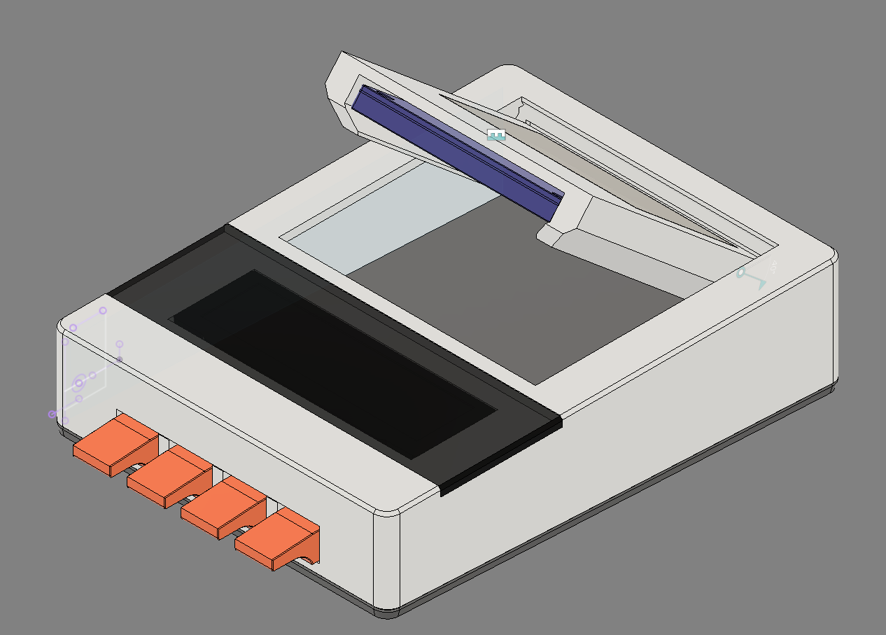

# Jazzette Player
> [!WARNING]  
> **This is work in progress**.  
> I am using this readme as a bit of a scratchpad of parts. Don't assume they're the final parts until this announcement is removed.  
> **This is work in progress**.

I got nerd sniped over on [reddit](https://www.reddit.com/r/homeassistant/comments/1vtjl21/comment/p4xepdl/).

## BOM

| Part | Quantity     | Link | Note |
|------|-------------|-------|----- |
| ESP32 S3 Nano | 1 | https://s.click.aliexpress.com/e/_c4tw9Hh5 |
| DRV8833 | 1 | https://www.amazon.com.au/Xlihdzum-DRV8833-H-Bridge-Driver-Module/dp/B0GHQ6YCLV |
| N20 DC motor | 1 | https://www.aliexpress.com/item/32385310725.html | 3v |
| PCM5100A breakout | 1 | https://www.aliexpress.com/item/1005008889469187.html |
| NFC breakout  | 1 | https://s.click.aliexpress.com/e/_c3WaMQwL |
| 3.12" OLED (256x54) SPI | 1 | https://s.click.aliexpress.com/e/_c2IVFyqT |
| TOSLINK transmitter | 1 | https://s.click.aliexpress.com/e/_c3J5kkCf |
| RCA plug     | 1 |  https://s.click.aliexpress.com/e/_c3TPM0xV     |
| 480ohm resistor    | 1 |       | 0803 SMD package |
| 0.1uF capacitor    | 3 |       | 0803 SMD package |
| 6x6 tactile switch    | 4  |       |
| 2 pin JST XH right angle | 2 |       | S2B-XH-A(LF)(SN) ||
| 3 pin JST XH right angle | 1 |       | S3B-XH-A(LF)(SN) ||
| 4 pin JST XH right angle | 1 |       | S4B-XH-A(LF)(SN) ||
| 5 pin JST XH right angle | 1 |       | S5B-XH-A(LF)(SN) ||
| 3-way switch | 1 | https://www.aliexpress.com/item/1005006780672833.html ||