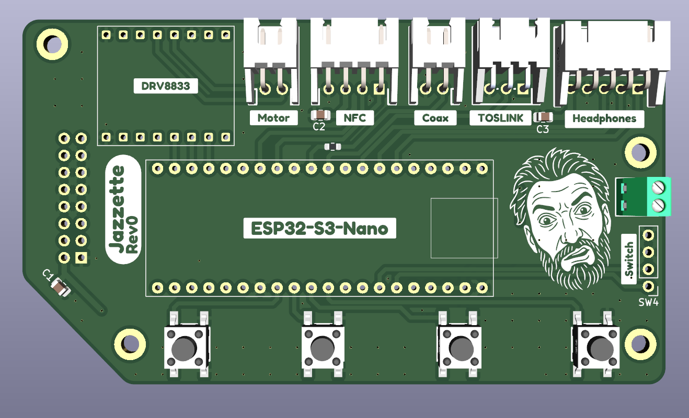
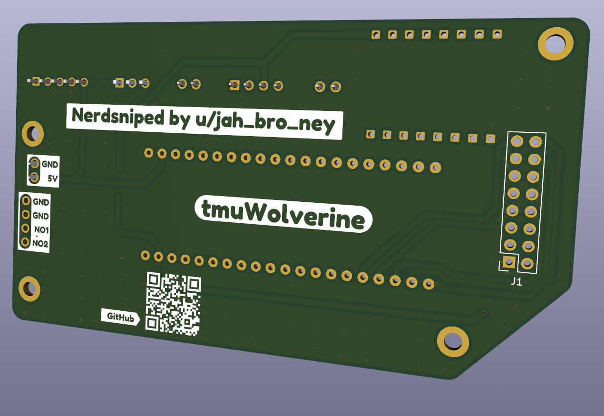

# Jazzette Player
> [!WARNING]  
> **This is work in progress**.  
> I am using this readme as a bit of a scratchpad of parts. Don't assume they're the final parts until this announcement is removed.  
> **This is work in progress**.

I got nerd sniped over on [reddit](https://www.reddit.com/r/homeassistant/comments/1vtjl21/comment/p4xepdl/).  

## PCB
PCB prototype has now been sent off for manufacture.  

## Shell
The shell is still in active development, but here is a render of the vague idea, mimicking the old cassettecorders. 

## BOM

| Part | Quantity     | Note |
|------|-------------|----- |
| [ESP32 S3 Nano](https://s.click.aliexpress.com/e/_c4tw9Hh5) | 1 ||
| [DRV8833](https://www.amazon.com.au/Xlihdzum-DRV8833-H-Bridge-Driver-Module/dp/B0GHQ6YCLV) | 1 |  |
| [N20 DC motor](https://www.aliexpress.com/item/32385310725.html) | 1 |  3v |
| [PCM5100A breakout](https://www.aliexpress.com/item/1005008889469187.html) | 1 | Headphone amp |
| [NFC breakout](https://s.click.aliexpress.com/e/_c3WaMQwL)  | 1 |  |
| [3.12" OLED (256x54) SPI](https://s.click.aliexpress.com/e/_c2IVFyqT) | 1 | White looks best IMO |
| [TOSLINK transmitter](https://s.click.aliexpress.com/e/_c3J5kkCf) | 1 |  |
| [RCA plug](https://s.click.aliexpress.com/e/_c3TPM0xV)     | 1 |       |
| 480ohm resistor    | 1 | 0803 SMD package, used for coax |
| 0.1uF capacitor    | 3 | 0803 SMD package, used for decoupling |
| 6x6 tactile switch    | 4  | SMD|
| 2 pin JST XH right angle | 2 | S2B-XH-A(LF)(SN) |
| 3 pin JST XH right angle | 1 | S3B-XH-A(LF)(SN) |
| 4 pin JST XH right angle | 1 | S4B-XH-A(LF)(SN) |
| 5 pin JST XH right angle | 1 | S5B-XH-A(LF)(SN) |
| [3-way switch](https://www.aliexpress.com/item/1005006780672833.html) | 1 |  |
| 3mm Translucent Black Acrylic | 1 | overlaid over screen |
| 3mm clear acrylic | 1 | Tape door |
| 3d printing filament | | |